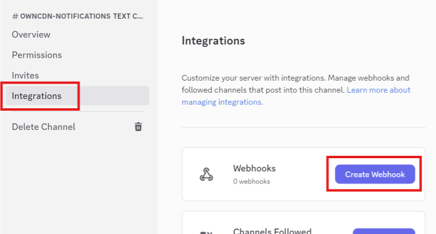
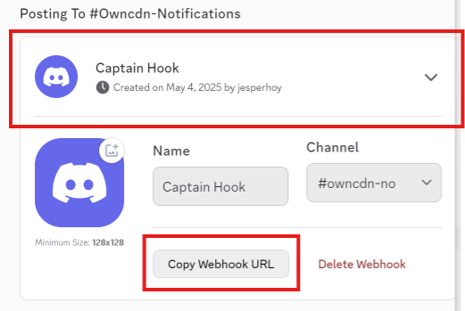

# How to generate webhook URL in Discord

To configure OwnCDN to send alerts via Discord (see [UI / Settings](../ui/settings.md)), you will need a Discord webhook URL.

In Discord, in the channel list, click on the gear icon next to the channel you wish to receive notifications in:

Click "Integrations" and click "Create Webhook":

That will generate a webhook (named "Captain Hook" by default).

Click the new webhook, and click "Copy Webhook URL":

Note, may also want to change the webhook name to something like "OwnCDN".
